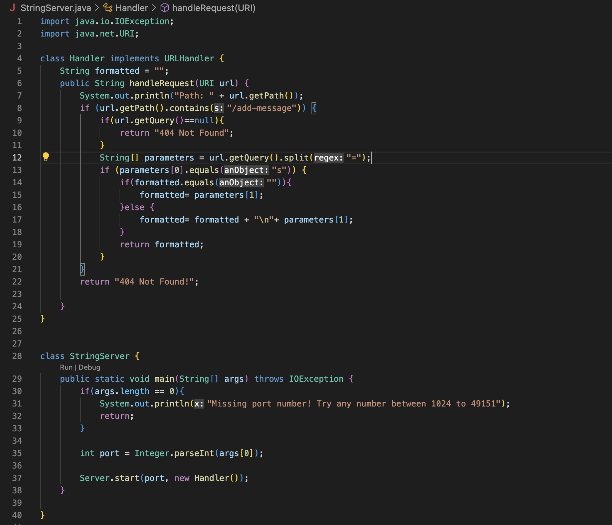
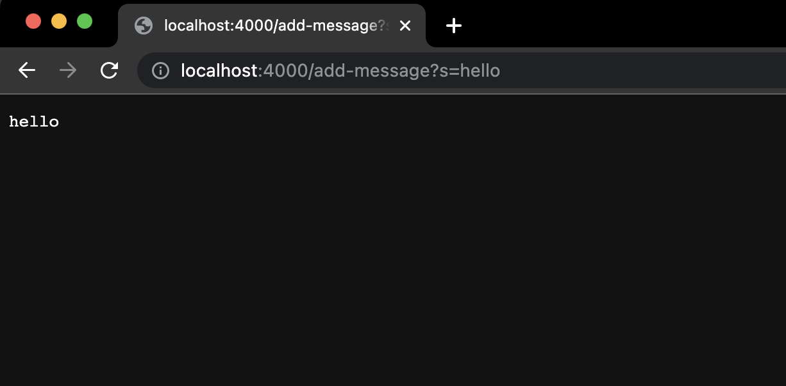
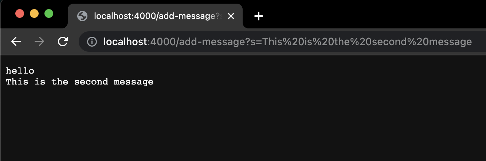
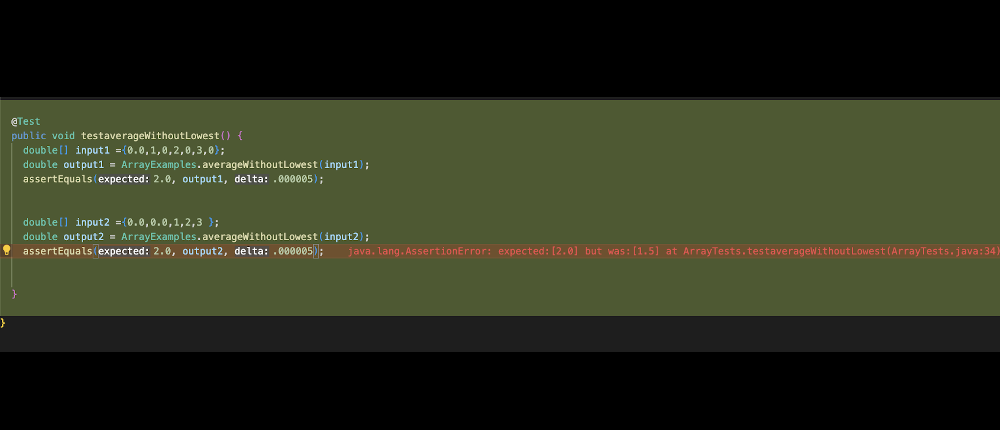

# Week 2 Lab Report
---

This contains three parts

* Web Server  
* Debugging from lab 3  
* What I learned  

---

## Web Server called `StringServer`

This is my code for `StringServer`


The following are two examples of /add-message being used.

###The first was `/add-message?s=hello`

1. The method in my code that got called was the handleRequuest method with the following method header `public String handleRequest(URI url)`
2. The relevent arguement for the class, url, was `/add-message?s=hello`
`url.getPath` is `/add-message`. The String array parameters that was initialized using url.getQuery().split("=") holds 2 values. paramters\[0\] is "s" and paramters\[0\] is "hello". 
4. The value of the String variable titles `formatted` was changed. The string "hello" was assigned to the variable. As it was the first string added to the variable, a new line was not added. 

###The second was `/add-message?s=this is the second message`

1. The method in my code that got called was the handleRequuest method with the following method header `public String handleRequest(URI url)`
2. The relevent arguement for the class, url, was `/add-message?s=this is the second message`. The Chrome browser automatically represented the spaces in the URL as %20 instead. 
`url.getPath` remains `/add-message`. The String array parameters still holds 2 values. paramters\[0\] is "s" again, however and paramters\[0\] is "this is the second message". 
4. The value of the String variable titles `formatted` was changed. First a new line was added by using "\n". The string "this is the second message" was added to the end of the string.

---

## Debugging from Lab 3

### Failure Inducing Input
```
public void testaverageWithoutLowest() {
    double\[\] input2 ={0.0,0.0,1,2,3 };  
    double output2 = ArrayExamples.averageWithoutLowest(input2);  
    assertEquals(2.0, output2, .000005);  
}
```

### Non Failure Inducing Input
```
public void testaverageWithoutLowest() {
    double\[\] input1 ={0.0,1,2,3 };  
    double output2 = ArrayExamples.averageWithoutLowest(input2);  
    assertEquals(2.0, output2, .000005);  
}
```

### Symptom


### The Bug

**Before:**
```
static double averageWithoutLowest(double\[\] arr) {  
    if(arr.length < 2) { return 0.0; }  
    double lowest = arr\[0\];  
    for(double num: arr) {  
      if(num < lowest) { lowest = num; }  
    }  
    double sum = 0.0;  
    for(double num: arr) {  
      if(num != lowest) { sum += num; }  
    }  
    return sum / (arr.length - 1);  
}
```

**After:**

```
static double averageWithoutLowest(double\[\] arr) {  
    if(arr.length < 2) { return 0.0; }   
    double lowest = arr\[0\];   
    for(double num: arr) {   
      if(num < lowest) { lowest = num; }   
    }  
    double sum = 0.0;  
    int numRemoved=0;  
    for(double num: arr) {  
      if(num != lowest) { sum += num; }  
      else{numRemoved++; }  
    }  
    if(numRemoved==arr.length){return 0.0;}  
    return sum / (arr.length - numRemoved);  
}
```


This fixes the problem because it accounts for how many instances of the lowest value where removed in order to get divide by how many values where added to sum to get the correct average. In addition it checks to see if the number of removed values equals the length of the original array incase the array contained only repotitions of the same value and were therefore all removed. If they were all removed, it returns 0.0 to avoid a divide by zero error that would be cause by dividing the sum by zero. 

---

## What I learned

I learned how to create a server that is accessable from my device and others by using my computer's (or a remote computer's) ports. I did not previously know that my computer had ports that I could use. I also learned about debugging by using Junit tests and how to run the tests through VS Code's Testing instead of only through the terminal. this made it significantly faster and easier for me to execute tests on the code.

