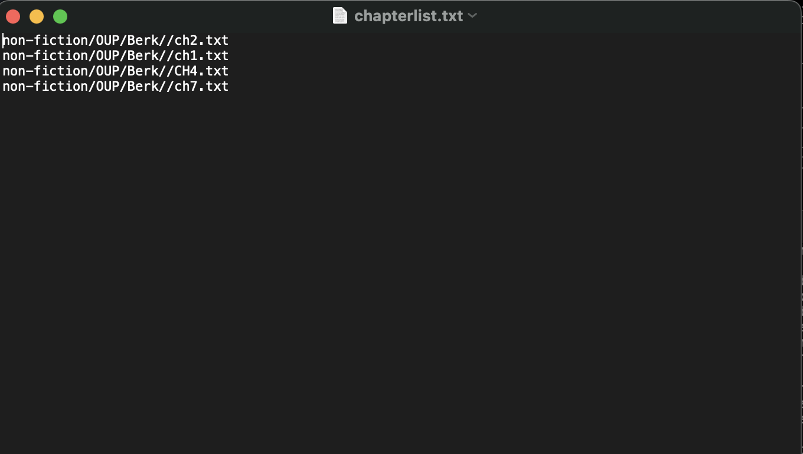
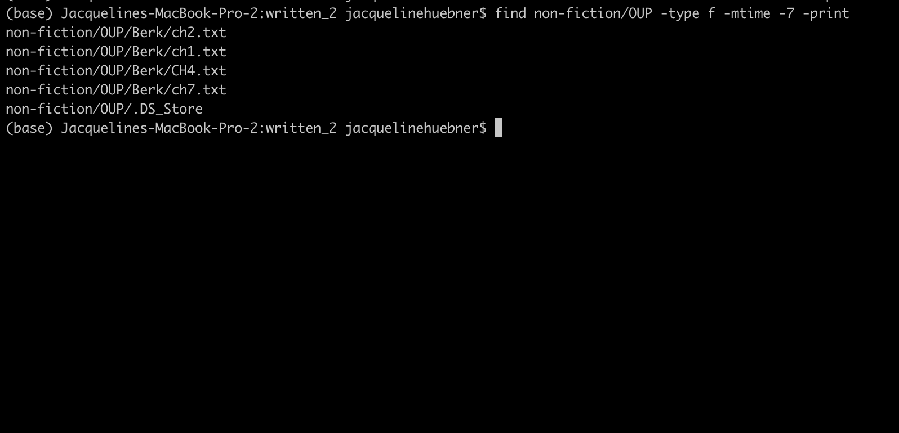
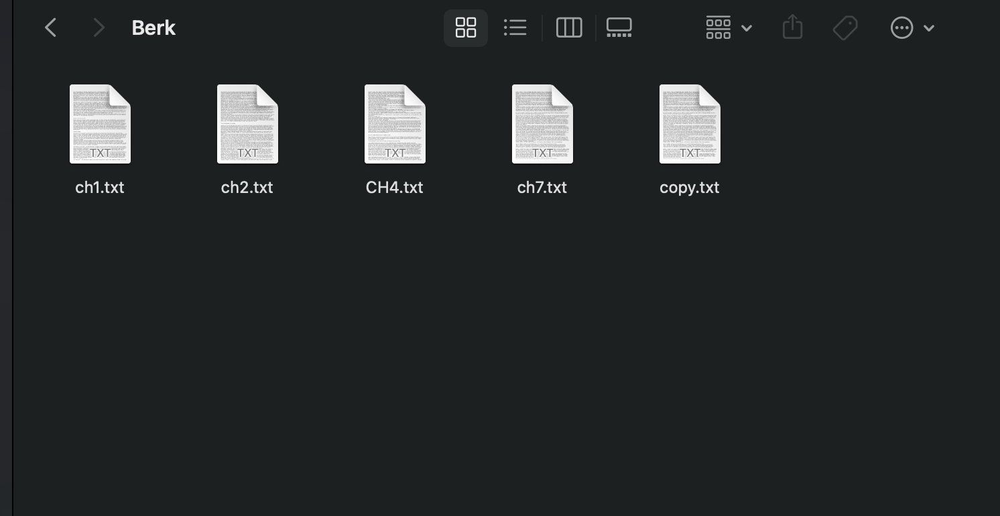
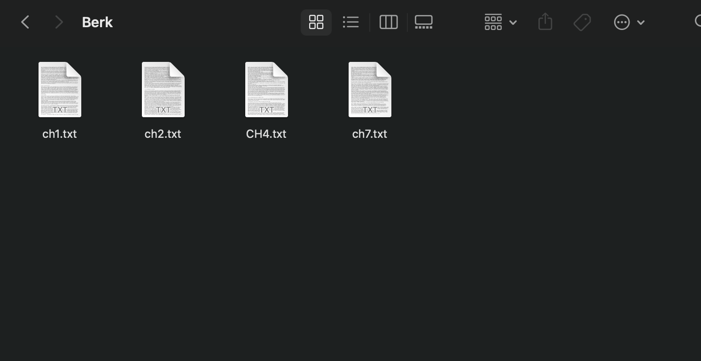

# Lab Report 5
---

In Lab Report 3 I focused on the command grep.
In this report I am looking into 4 ways to use the command find.

* -exec
* -print
* -delete
* -size

---

## -exec
This option executes a specified command on the files that are found. it is added after any modifications to find (ex -name) and is followed by the command the user whants to run on that file. This can be useful to make changes to many files at the same time.

I found this using ChatGPT and [linuxcommand](https://linuxcommand.org/lc3_man_pages/find1.html)

An example of is changing the permissions of the .txt files in non-fiction/OP/Berk.

```
find non-fiction/OUP/Berk/ -name '*.txt' -exec chmod 644 {}\;
```
This output of this command is that it would set the permissions of these files so that the owner can read and write the files however others can only read the chapters.

Another example would be if you wanted to add a string at the end of each chapter file.
```
find non-fiction/OUP/Berk/ -name '*.txt' -exec sh -c 'echo "END OF FILE" >> {}' \;
```
The output of this is adding the string "END OF FILE" at the bottom of all the .txt files in the Berk directory. 


---

## -print
This option prints the names of the files found by `find`. This can be useful to easily see all the files that match the search and to output it to a seperate file.

I found this using ChatGPT and [linuxcommand](https://linuxcommand.org/lc3_man_pages/find1.html)

An example of this in non-fiction/OP/Berk is using -print to get the names of the chapters in a seperate file. I used this in tandum with -name and > to redirect output.

```
find non-fiction/OUP/Berk/ -name '*.txt' -print > chapterlist.txt
```
The output of this is a new file in the written_2 directory titled "chapterlist.txt" with the following content.




Another example is using -print along with -mtime and -type to list all files that were recently modified. -mtime -7 finds files that were modified in the last day and -type f finds all files in `non-fiction/OUP` directory and its subdirectories.
```
find non-fiction/OUP -type f -mtime -7 -print
```
The output is printed in the terminal as a list of the files that I have modified recently in the `non-fiction/OUP` directory, mainly the chapter files in the Berk directory that I modified using the previously mentioned -exec option.



---

## -delete
This option deletes the files found using find. However it does so without confirmation and permanently deletes them, so this option should be used with caution. This can be useful to delete multiple files or delete specfic files from the terminal. There is no output to the terminal when this command is run successfully.

I found this using ChatGPT and [linuxcommand](https://linuxcommand.org/lc3_man_pages/find1.html)

Here is an example of it being used:
After creating a file called copy.txt as I do not actually want to delete anything in this directory, I ran the following command.

```
find non-fiction/OUP/Berk/ -name 'copy.txt' -delete
```
Before the command is run, the berk directory looked like this:


The output for the above command that the `copy.txt` file was deleted and can no longer be found in the Berk directory.



The command can also be used to delete directories within `OUP` when used along with -type. -type d finds directories. This can become more useful to delete only empty directories, however written_2 does not contain any empty directories. -empty would find only the ones that have no content. 

```
find non-fiction/OUP/ -type d -delete
```
The output of the command is that the directories 
`Abernathy`, `Berk`, `Castro`, `Fletcher`, `Kauffman`, and `Rybczynski` are all permanently deleted.

---

## -size

This option find files that are a specific size. When using `-size` it is followed by a number and then the units for the size (`M` for megabyte, `k` for kilobyte etc). this can be on its own meaning exactly that size or preceded by a `+` for greater than and `-` for less than. This can be useful to quickly locate files that are very large or very small.
I found this using ChatGPT and [linuxcommand](https://linuxcommand.org/lc3_man_pages/find1.html)

To quickly find all the larger .txt files in the written_2 directory, I used -size +100k to find all the files with a size greated than 100 kilobytes. I used that as well as the options -type f to find all files in the current and sub directories and -exec to execute the next command on each of the files found. `ls -lh {} \; | awk '{print $5, $9}'`takes the output from `ls -lh` and used the `awk` command to only print out the size and name of each file.

```
find . -type f -size +100k -exec ls -lh {} \; | awk '{print $5, $9}'
```
The output of the command is the following.

```
101K ./non-fiction/OUP/Berk/CH4.txt
169K ./travel_guides/berlitz1/WhereToIndia.txt
288K ./travel_guides/berlitz1/WhereToItaly.txt
177K ./travel_guides/berlitz1/WhereToMalaysia.txt
185K ./travel_guides/berlitz1/WhereToJapan.txt
248K ./travel_guides/berlitz1/WhereToFrance.txt
117K ./travel_guides/berlitz2/Portugal-WhereToGo.txt
230K ./travel_guides/berlitz2/Canada-WhereToGo.txt
193K ./travel_guides/berlitz2/China-WhereToGo.txt
```


This option can also be used to find files between two sizes, the bounds being inclusive. I used -size + and -size - to specify a range
```
find non-fiction/OUP/Berk -size +80k -size -104k
```
The output is with the size of these files in order being 103 kilobytes, 92 kilobytes, and 104 kilobytes. This did not return ch7.txt as it is 67 kilobytes and outside the range.
```
non-fiction/OUP/Berk/ch2.txt
non-fiction/OUP/Berk/ch1.txt
non-fiction/OUP/Berk/CH4.txt
```
