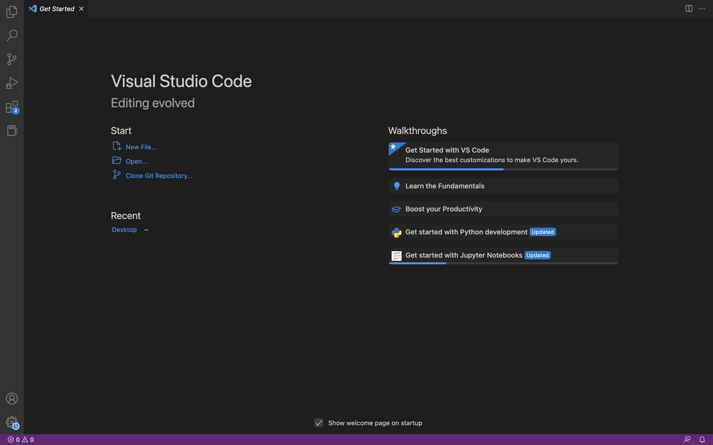
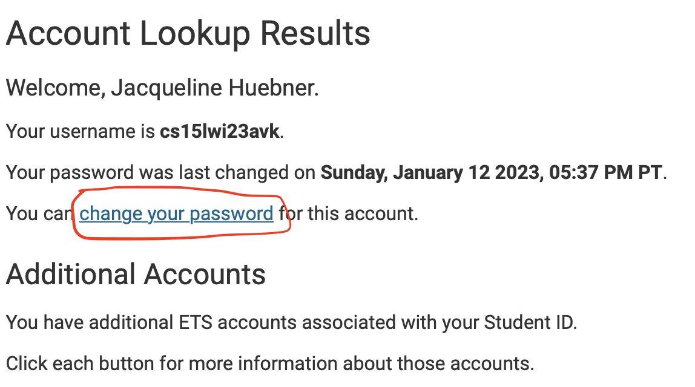
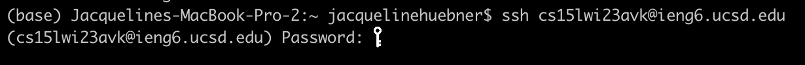
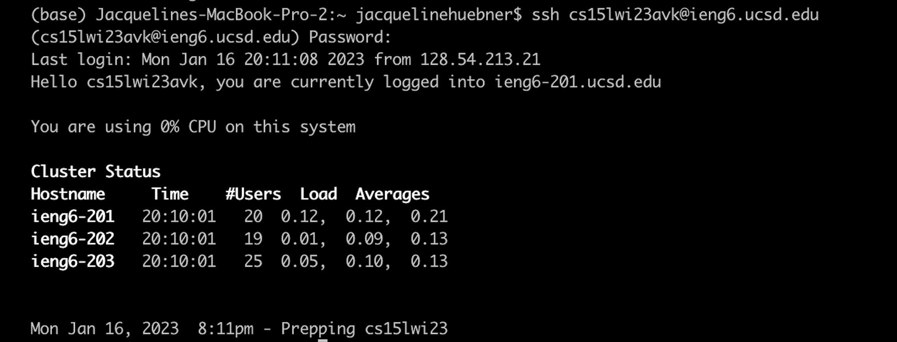
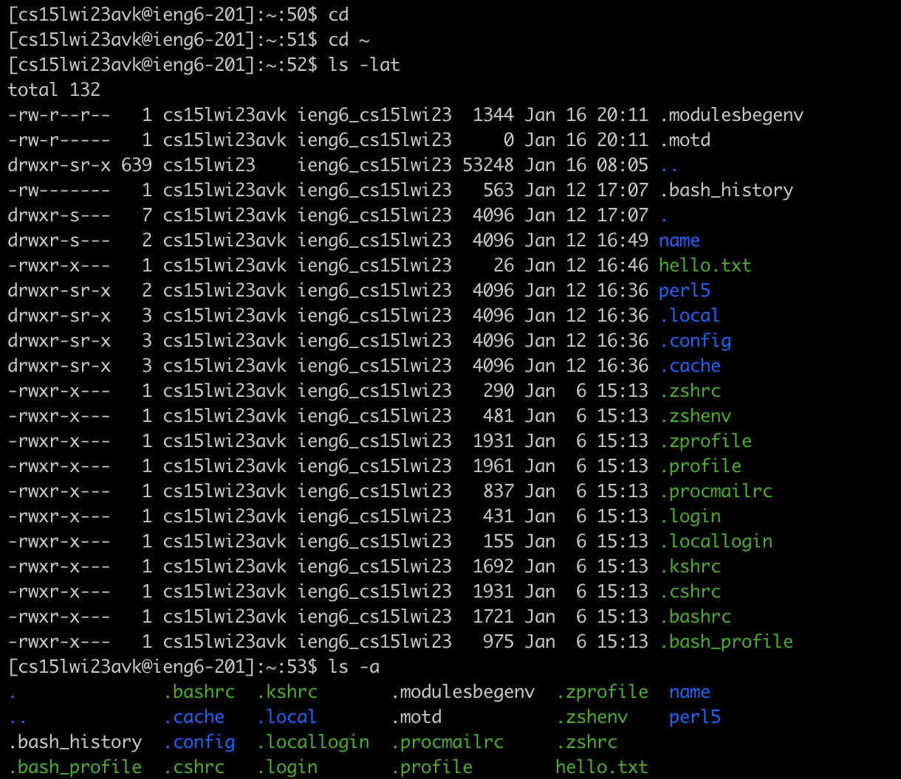
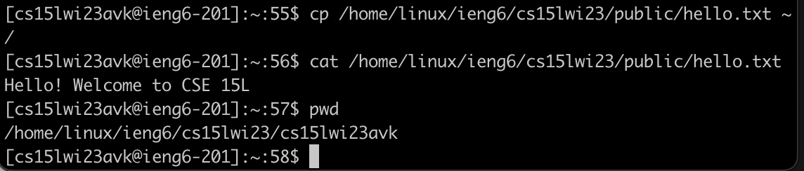

# Week 1 Lab Report

---

This is a tutorial on how to log on to your course specific account on `ieng6` for CSE 15L. The three parts covered are 

* Instaling VS Code
* Remotely Connecting
* Trying Some Commands

---

## Instaling VS Code

1. Visit [VS Code Website](https://code.visualstudio.com/)
2. Download and install the version for your operating system (macOS or Windows)
3. Opening VS Code should look something like the image below

---

## Remotely Connecting

### Account Look Up/ Resetting Password
* Find the course specefic account by visiting [Account Lookup](https://sdacs.ucsd.edu/~icc/index.php)
The account for CSE 15L Winter 23 should begin with cs15lwi23 followed by 3 letters specific to your account. 
* Reset password by clicking on the additional account and following link to change password

* After confirming your new password hit enter instead of check password
* Wait 15-60 minutes before attempting to log in

### Connecting to ssh
1. Open terminal (iTerm in applications) on macOS or terminal on VS code (Press Ctrl or Command + \` while in VS Code) if on Windows.
2. run the following command, replacing zzz with the last 3 letters of your course specific account 
>ssh cs15lwi23zzz@ieng6.ucsd.edu

3. Type in your password and then hit enter. Be careful to not add spaces before or after. (password will be hidden while you type) It should like similar to the image below

4. After logging in the terminal should print out the following

---

## Trying Some Commands

Once logged on to the remote server or on your own computer you can attempt to use some commands.

The following commands are useful
* cd -the command cd followed by a pathway changes the working directory. ".." is used to represent the parent directory. 
* ls -lat
* ls -a
* ls (directory)- ls lists out the files in the current directory as shown in the image below

* cp /home/linux/ieng6/cs15lwi23/public/hello.txt ~/
  * cp copied the file of directories specificed by the pathway following the command 
* cat /home/linux/ieng6/cs15lwi23/public/hello.txt
  * cat reads and prints out the content of files

Other Commands Include:
* pwd -shows the full pathway of the current directory

* mkdir -creates a new directory

**To exit server use the command `exit` or Ctrl- D**
  

